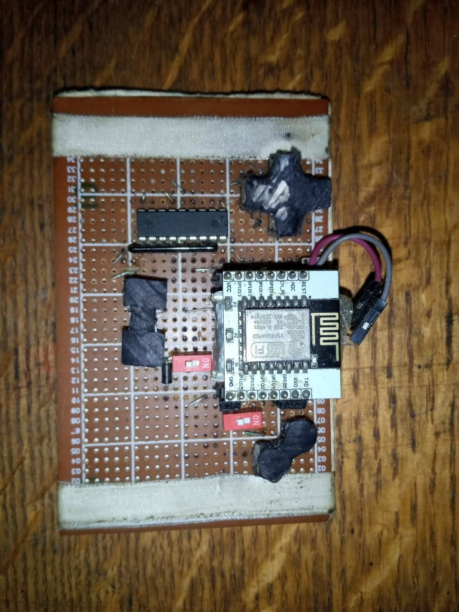
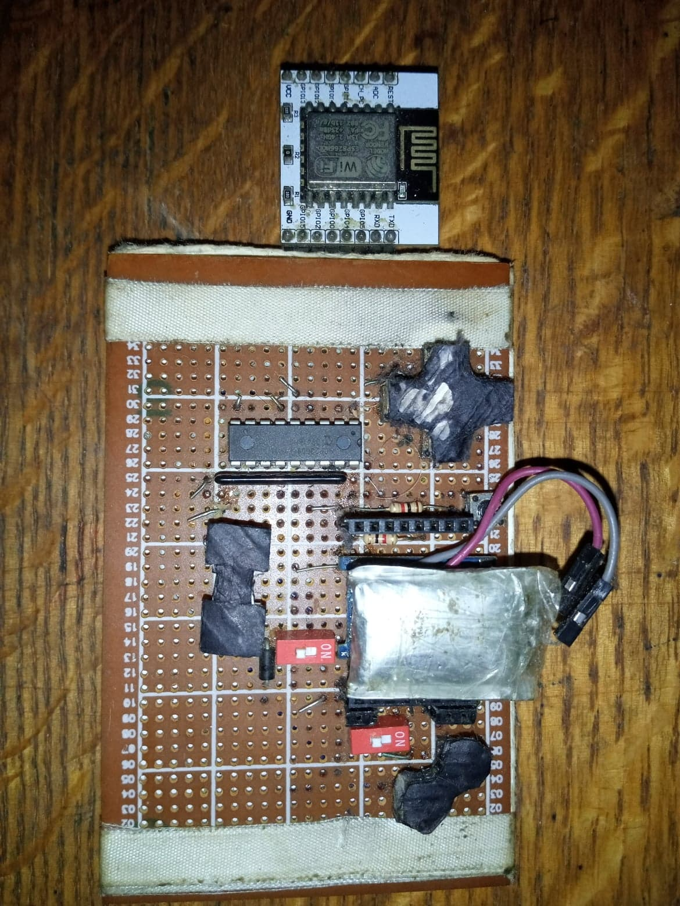
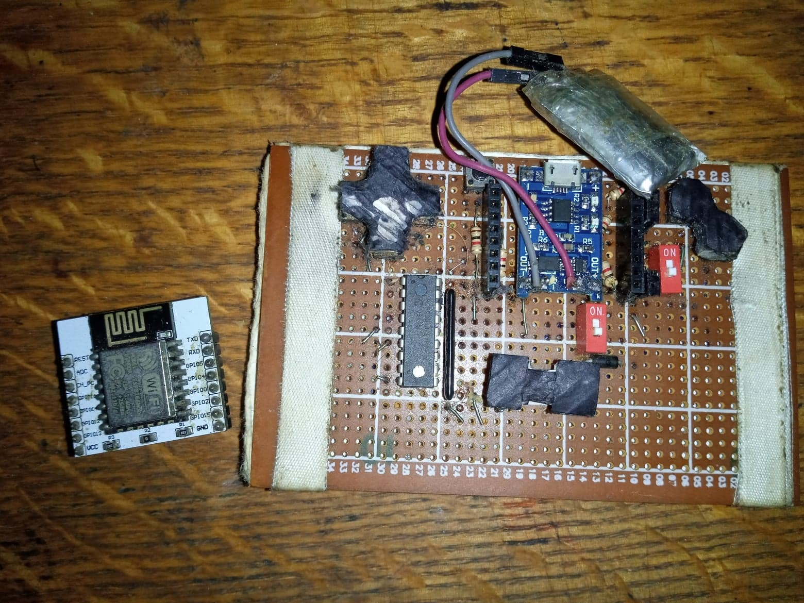

# Custom NES Controller
- This project is about creating a custom-made chargeable wireless gaming controller through a LAN network.
- An I^2C GPIO buffer extender is used to increase the number of GPIOs available for the buttons.
- Communication between the device and server is in UDP.
- The mapping between the buttons and keyboard can be modified at the server code.

**Components used**

- ESP-12E.
- I2C GPIO extender.
- Li-ion battery.
- 5V Li-ion battery charger.
- Buttons.
- Protoboard.

**Platforms used**

- Arduino IDE.
- Any Java IDE as a server-side.

**Design**

**Future work**

- Can embed vJoy device virtualization in the server code to create a virtual gamepad.
